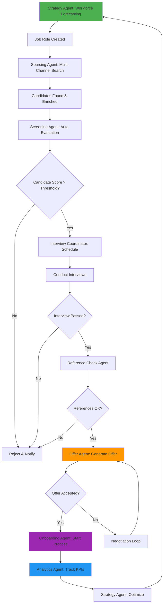

# AIM Autonomous Talent Acquisition Engine
## Enterprise-Grade AI Agentic System

---

## 1. EXECUTIVE SUMMARY

The AIM Autonomous Talent Acquisition Engine is a fully autonomous, multi-agent AI system that manages the complete hiring lifecycle for Alberta Injury Management Inc. The system operates 24/7, executing strategic workforce planning, candidate sourcing, screening, interview coordination, offer generation, and onboarding with minimal human intervention. Built on a modern event-driven architecture with persistent memory, the system provides enterprise-grade talent acquisition capabilities equivalent to Greenhouse, Lever, and Eightfold.ai, optimized specifically for healthcare talent acquisition in Alberta, Canada.

---

## 2. SYSTEM ARCHITECTURE

```
┌─────────────────────────────────────────────────────────────────────┐
│                         PRESENTATION LAYER                          │
│  ┌──────────────┐  ┌──────────────┐  ┌──────────────┐            │
│  │  Dashboard   │  │   Pipeline   │  │  Analytics   │            │
│  │   Portal     │  │   Manager    │  │   Reports    │            │
│  └──────────────┘  └──────────────┘  └──────────────┘            │
└─────────────────────────────────────────────────────────────────────┘
                              │
┌─────────────────────────────────────────────────────────────────────┐
│                      AGENT ORCHESTRATION LAYER                      │
│  ┌────────────────────────────────────────────────────────────────┐│
│  │              Central Agent Coordinator (CAC)                   ││
│  │          - Task Distribution  - Conflict Resolution            ││
│  │          - Memory Management  - Event Routing                  ││
│  └────────────────────────────────────────────────────────────────┘│
│                                                                     │
│  ┌──────────┐ ┌──────────┐ ┌──────────┐ ┌──────────┐ ┌─────────┐│
│  │Strategy  │ │Sourcing  │ │Screening │ │Interview │ │Offer &  ││
│  │Agent     │ │Agent     │ │Agent     │ │Coord.    │ │Onboard  ││
│  └──────────┘ └──────────┘ └──────────┘ └──────────┘ └─────────┘│
│  ┌──────────┐ ┌──────────┐                                        │
│  │Analytics │ │Compliance│                                        │
│  │Agent     │ │Agent     │                                        │
│  └──────────┘ └──────────┘                                        │
└─────────────────────────────────────────────────────────────────────┘
                              │
┌─────────────────────────────────────────────────────────────────────┐
│                        SERVICES LAYER                               │
│  ┌──────────────┐  ┌──────────────┐  ┌──────────────┐            │
│  │   Workflow   │  │  AI Services │  │ Integration  │            │
│  │   Engine     │  │   (LLM API)  │  │   Service    │            │
│  └──────────────┘  └──────────────┘  └──────────────┘            │
└─────────────────────────────────────────────────────────────────────┘
                              │
┌─────────────────────────────────────────────────────────────────────┐
│                      DATA PERSISTENCE LAYER                         │
│                      (Supabase PostgreSQL)                          │
│  ┌──────────────┐  ┌──────────────┐  ┌──────────────┐            │
│  │  Candidates  │  │    Jobs      │  │  Workflows   │            │
│  │  Interviews  │  │   Events     │  │     KPIs     │            │
│  └──────────────┘  └──────────────┘  └──────────────┘            │
└─────────────────────────────────────────────────────────────────────┘
                              │
┌─────────────────────────────────────────────────────────────────────┐
│                      EXTERNAL INTEGRATIONS                          │
│  LinkedIn │ Indeed │ ZipRecruiter │ Gmail │ Calendar │ SMS         │
└─────────────────────────────────────────────────────────────────────┘
```

---

## 3. END-TO-END AGENTIC WORKFLOW



---

## 4. AGENT DEFINITIONS

### 4.1 Strategy Agent
**Purpose**: Workforce planning, forecasting, and hiring strategy

**Capabilities**:
- Analyze historical hiring data and clinical volume trends
- Predict staffing shortages by location and role
- Generate headcount plans (monthly, quarterly, annually)
- Calibrate job descriptions and compensation packages
- Optimize hiring strategies based on market conditions

**Autonomous Actions**:
- Create job requisitions when gaps detected
- Adjust compensation recommendations
- Trigger hiring campaigns
- Recommend sourcing channel allocation

**Decision Triggers**:
- Weekly: Forecast review
- Monthly: Headcount planning
- Event-driven: Resignation detected, volume spike detected

---

### 4.2 Sourcing Agent
**Purpose**: Multi-channel candidate acquisition

**Capabilities**:
- Post jobs to Indeed, LinkedIn, ZipRecruiter
- Build Boolean search strings for passive candidates
- Scrape professional networks (LinkedIn, healthcare directories)
- Generate personalized outreach messages
- Track sourcing channel performance
- Maintain candidate enrichment pipeline

**Autonomous Actions**:
- Post jobs to all channels automatically
- Send outreach emails to passive candidates
- Re-engage candidates from previous pipelines
- A/B test job postings and messaging

**Decision Triggers**:
- New job created → Post to all channels
- Low applicant volume → Activate passive sourcing
- High-quality candidate found → Priority outreach

---

### 4.3 Screening Agent
**Purpose**: Automated candidate evaluation and shortlisting

**Capabilities**:
- Parse and analyze resumes
- Score candidates using competency model
- Conduct automated screening interviews (chat/email)
- Generate candidate reports with hiring recommendations
- Identify red flags and qualification gaps

**Autonomous Actions**:
- Auto-reject candidates below threshold
- Schedule screening calls for mid-tier candidates
- Fast-track high-scoring candidates
- Request additional information when needed

**Decision Triggers**:
- New application received → Screen immediately
- Screening completed → Route to interview or reject

---

### 4.4 Interview Coordinator Agent
**Purpose**: Calendar management and interview logistics

**Capabilities**:
- Coordinate multi-party scheduling
- Handle time zones, conflicts, and preferences
- Send confirmations and reminders
- Manage reschedules automatically
- Collect interview feedback

**Autonomous Actions**:
- Find optimal interview slots across calendars
- Send calendar invites
- Handle reschedule requests
- Send preparation materials to candidates
- Collect feedback post-interview

**Decision Triggers**:
- Candidate ready for interview → Schedule immediately
- Interview cancelled → Reschedule within 24h
- Feedback missing → Send reminder

---

### 4.5 Offer & Onboarding Agent
**Purpose**: Offer generation, negotiation, and onboarding automation

**Capabilities**:
- Generate Canadian-compliant offer letters
- Handle salary negotiations within parameters
- Create personalized onboarding workflows
- Generate compliance checklists
- Trigger HRIS integration

**Autonomous Actions**:
- Generate offer letter automatically
- Counter-offer within approved range
- Escalate complex negotiations
- Launch onboarding sequence on acceptance
- Schedule first-day orientation

**Decision Triggers**:
- All interviews passed + references cleared → Generate offer
- Offer accepted → Start onboarding
- Day before start date → Send welcome package

---

### 4.6 Compliance Agent
**Purpose**: Legal, regulatory, and policy compliance

**Capabilities**:
- Validate Canadian employment law compliance
- Ensure Alberta-specific regulations
- Check credential requirements (physiotherapy licenses, etc.)
- Audit hiring decisions for bias
- Maintain compliance documentation

**Autonomous Actions**:
- Block non-compliant actions
- Flag missing credentials
- Generate compliance reports
- Alert on policy violations

**Decision Triggers**:
- Before offer generation → Compliance check
- Monthly → Audit report
- Policy violation detected → Immediate alert

---

### 4.7 Analytics Agent
**Purpose**: KPI tracking, reporting, and optimization

**Capabilities**:
- Track time-to-fill, cost-per-hire, conversion rates
- Analyze sourcing channel performance
- Predict retention risk
- Generate dashboards and reports
- Identify optimization opportunities

**Autonomous Actions**:
- Daily KPI updates
- Weekly performance reports
- Monthly strategy recommendations
- Anomaly detection and alerts

**Decision Triggers**:
- Daily: Update metrics
- Weekly: Generate reports
- Threshold breach: Alert leadership

---

## 5. DATA STRUCTURES / MEMORY SCHEMA

### Core Tables

#### jobs
- id (uuid)
- title (text)
- role_type (enum: physiotherapist, kinesiologist, massage_therapist, etc.)
- location (text)
- status (enum: draft, active, on_hold, filled, cancelled)
- compensation_min (numeric)
- compensation_max (numeric)
- job_description (text)
- requirements (jsonb)
- created_by_agent (text)
- priority_score (numeric)
- target_fill_date (date)
- created_at, updated_at

#### candidates
- id (uuid)
- email (text, unique)
- first_name, last_name
- phone
- resume_url (text)
- linkedin_url (text)
- source_channel (text)
- enrichment_data (jsonb)
- overall_score (numeric)
- status (enum: new, screening, interviewing, offered, hired, rejected)
- created_at, updated_at

#### applications
- id (uuid)
- candidate_id (fk)
- job_id (fk)
- status (enum: applied, screening, interview, offered, accepted, rejected)
- screening_score (numeric)
- screening_notes (text)
- interview_scores (jsonb)
- offer_details (jsonb)
- rejection_reason (text)
- stage (text)
- created_at, updated_at

#### interviews
- id (uuid)
- application_id (fk)
- interview_type (enum: screening, technical, cultural, final)
- scheduled_at (timestamptz)
- interviewer_email (text)
- status (enum: scheduled, completed, cancelled, rescheduled)
- feedback (jsonb)
- score (numeric)
- recommendation (text)

#### agent_events
- id (uuid)
- agent_name (text)
- event_type (text)
- entity_type (text)
- entity_id (uuid)
- payload (jsonb)
- status (enum: pending, processing, completed, failed)
- error_message (text)
- created_at, processed_at

#### agent_memory
- id (uuid)
- agent_name (text)
- memory_key (text)
- memory_value (jsonb)
- expires_at (timestamptz)
- created_at, updated_at

#### workflows
- id (uuid)
- name (text)
- trigger_type (text)
- conditions (jsonb)
- actions (jsonb)
- is_active (boolean)
- execution_count (integer)

#### kpis
- id (uuid)
- metric_name (text)
- metric_value (numeric)
- dimensions (jsonb)
- period_start, period_end (date)
- created_at

---

## 6. API INTEGRATION SPECIFICATIONS

### External APIs Required

#### 6.1 LinkedIn Recruiter API
- **Endpoint**: LinkedIn Recruiter System Connect
- **Purpose**: Post jobs, search candidates, send InMails
- **Auth**: OAuth 2.0
- **Key Operations**:
  - POST /jobs - Create job posting
  - GET /candidates/search - Boolean search
  - POST /messages - Send InMail

#### 6.2 Indeed API
- **Endpoint**: Indeed Publisher API
- **Purpose**: Post jobs, receive applications
- **Auth**: API Key
- **Key Operations**:
  - POST /v2/jobs - Create posting
  - GET /v2/applications - Fetch applications

#### 6.3 Gmail API / SendGrid
- **Purpose**: Automated email communications
- **Auth**: OAuth 2.0 / API Key
- **Key Operations**:
  - Send screening emails
  - Send offer letters
  - Automated follow-ups

#### 6.4 Google Calendar API
- **Purpose**: Interview scheduling
- **Auth**: OAuth 2.0
- **Key Operations**:
  - Check availability
  - Create events
  - Send invites

#### 6.5 Twilio API
- **Purpose**: SMS notifications
- **Auth**: API Key
- **Key Operations**:
  - Send interview reminders
  - Send offer notifications

---

## 7. EVENT-DRIVEN WORKFLOW LOGIC

### Event Processing Pipeline

```
┌─────────────┐     ┌──────────────┐     ┌──────────────┐
│   Trigger   │────>│ Event Queue  │────>│Agent Executor│
│  (DB/Cron)  │     │  (Supabase)  │     │              │
└─────────────┘     └──────────────┘     └──────────────┘
                                                │
                                                ▼
                                    ┌──────────────────────┐
                                    │ Action Execution     │
                                    │ - API Calls          │
                                    │ - DB Updates         │
                                    │ - Nested Events      │
                                    └──────────────────────┘
```

### Key Event Types

1. **job.created** → Sourcing Agent posts to all channels
2. **application.received** → Screening Agent evaluates
3. **screening.passed** → Interview Coordinator schedules
4. **interview.completed** → Screening Agent aggregates feedback
5. **references.cleared** → Offer Agent generates offer
6. **offer.accepted** → Onboarding Agent starts workflow
7. **forecast.shortage_detected** → Strategy Agent creates job
8. **kpi.threshold_breached** → Analytics Agent alerts

---

## 8. AUTONOMOUS CONTROL LOOP

### Execution Architecture

```javascript
// Main Control Loop (runs every 60 seconds)
async function autonomousExecutionLoop() {
  while (true) {
    try {
      // 1. Fetch pending events
      const events = await fetchPendingEvents();

      // 2. Distribute to agents
      for (const event of events) {
        await routeToAgent(event);
      }

      // 3. Execute scheduled tasks
      await executeScheduledTasks();

      // 4. Health check all agents
      await monitorAgentHealth();

      // 5. Update KPIs
      await updateRealTimeKPIs();

      // 6. Check for human escalations
      await checkEscalations();

    } catch (error) {
      await handleSystemError(error);
    }

    await sleep(60000); // 60 second interval
  }
}

// Agent Execution Pattern
async function executeAgent(agentName, event) {
  const agent = agents[agentName];

  // 1. Load agent memory
  const memory = await loadAgentMemory(agentName);

  // 2. Execute agent logic
  const result = await agent.execute(event, memory);

  // 3. Persist updated memory
  await saveAgentMemory(agentName, result.memory);

  // 4. Emit new events
  await emitEvents(result.events);

  // 5. Log execution
  await logExecution(agentName, event, result);

  return result;
}
```

---

## 9. DEPLOYMENT INSTRUCTIONS

### Infrastructure Requirements
- Supabase Project (PostgreSQL + Authentication + Storage)
- Frontend Hosting (Vercel / Netlify)
- Background Worker (Node.js service for agent execution)
- API Keys: OpenAI/Claude, LinkedIn, Indeed, Gmail, Twilio

### Deployment Steps

1. **Database Setup**
   ```bash
   # Migrations will auto-apply via Supabase MCP tools
   # Tables: jobs, candidates, applications, interviews, agent_events, etc.
   ```

2. **Environment Variables**
   ```
   VITE_SUPABASE_URL=<supabase_url>
   VITE_SUPABASE_ANON_KEY=<anon_key>
   SUPABASE_SERVICE_ROLE_KEY=<service_role_key>
   OPENAI_API_KEY=<openai_key>
   LINKEDIN_CLIENT_ID=<linkedin_id>
   LINKEDIN_CLIENT_SECRET=<linkedin_secret>
   INDEED_API_KEY=<indeed_key>
   GMAIL_CLIENT_ID=<gmail_id>
   TWILIO_API_KEY=<twilio_key>
   ```

3. **Deploy Frontend**
   ```bash
   npm run build
   # Deploy to Vercel/Netlify
   ```

4. **Deploy Agent Workers**
   ```bash
   # Use Supabase Edge Functions for agent execution
   # Each agent runs as separate function
   ```

5. **Initialize System**
   - Seed initial jobs
   - Configure workflows
   - Set up cron triggers

---

## 10. EXAMPLE RUN: SIMULATED HIRING PROCESS

### Scenario: Hire Physiotherapist in Calgary

**Day 1 - 09:00 AM**
- **Strategy Agent** detects staffing shortage at Calgary clinic
- Auto-creates job: "Senior Physiotherapist - Calgary"
- Sets compensation range: $85K-$105K CAD
- Priority: High

**Day 1 - 09:15 AM**
- **Sourcing Agent** receives `job.created` event
- Posts to Indeed, LinkedIn, ZipRecruiter
- Initiates passive search: finds 43 potential candidates on LinkedIn
- Sends 10 personalized InMails

**Day 2 - 10:30 AM**
- 23 applications received via Indeed
- **Screening Agent** evaluates all 23 resumes
- Scores: 5 candidates > 85/100, 12 candidates 60-85, 6 candidates < 60
- Auto-rejects 6 low-scoring candidates with personalized emails
- Fast-tracks 5 high-scoring candidates

**Day 3 - 02:00 PM**
- **Interview Coordinator** schedules screening calls for top 5
- Finds optimal slots across hiring manager's calendar
- Sends calendar invites + prep materials
- Sets up automated reminders

**Day 5 - 04:00 PM**
- 3 candidates pass screening interviews
- **Interview Coordinator** schedules panel interviews
- Coordinates 3 clinicians + HR manager calendars

**Day 8 - 11:00 AM**
- All panel interviews completed
- **Screening Agent** aggregates feedback: 1 strong yes, 1 maybe, 1 no
- Top candidate: Sarah Chen (Score: 92/100)

**Day 9 - 09:00 AM**
- **Offer Agent** initiates reference checks
- Sends automated reference questionnaires to 3 references
- Receives responses within 24 hours
- References: Excellent ratings (4.8/5.0 avg)

**Day 10 - 10:00 AM**
- **Compliance Agent** validates: License valid, credentials verified
- **Offer Agent** generates offer letter
- Offer: $95,000 CAD, benefits package, signing bonus
- Sends to candidate via email

**Day 11 - 03:00 PM**
- Sarah negotiates: requests $98,000
- **Offer Agent** auto-approves (within approved range)
- Sends revised offer

**Day 12 - 09:00 AM**
- Offer accepted!
- **Onboarding Agent** triggered
- Sends welcome package
- Creates onboarding checklist
- Schedules first-day orientation
- Notifies HR, IT, clinic manager

**Day 13**
- **Analytics Agent** updates KPIs:
  - Time-to-fill: 12 days (target: 14 days) ✓
  - Cost-per-hire: $2,100 (under budget) ✓
  - Source: Indeed (tracks for optimization)
  - Pipeline conversion: 23 applicants → 1 hire (4.3%)

**Ongoing**
- **Strategy Agent** learns from this hire
- Adjusts future Calgary physiotherapist searches
- Updates compensation benchmarks
- Optimizes sourcing channel mix (Indeed performed best)

---

## SYSTEM CAPABILITIES COMPARISON

| Feature | AIM AI Engine | Greenhouse | Lever | BambooHR |
|---------|---------------|------------|-------|----------|
| Autonomous Execution | ✓ Full | ✗ Manual | ✗ Manual | ✗ Manual |
| Multi-Agent Architecture | ✓ 7 Agents | ✗ | ✗ | ✗ |
| Workforce Forecasting | ✓ AI-Powered | ✗ | ✗ | ✗ |
| Auto Job Creation | ✓ | ✗ | ✗ | ✗ |
| Multi-Channel Sourcing | ✓ Automated | Manual | Manual | Limited |
| AI Screening | ✓ Full Auto | Partial | Partial | Basic |
| Auto Scheduling | ✓ | ✗ | Partial | ✗ |
| Reference Check Automation | ✓ | ✗ | ✗ | ✗ |
| Auto Offer Generation | ✓ | Template | Template | Template |
| 24/7 Autonomous Operation | ✓ | ✗ | ✗ | ✗ |
| Cost | Custom | $6K-15K/yr | $6K-12K/yr | $4K-8K/yr |

---

## CONCLUSION

The AIM Autonomous Talent Acquisition Engine represents a paradigm shift from traditional ATS systems to fully autonomous hiring operations. By leveraging multi-agent AI architecture, event-driven workflows, and persistent memory, the system operates as a complete talent acquisition department that works 24/7, thinks strategically, and executes with minimal human oversight.

**Next Steps**: Proceed to implementation phase with database migrations, agent development, and UI construction.
